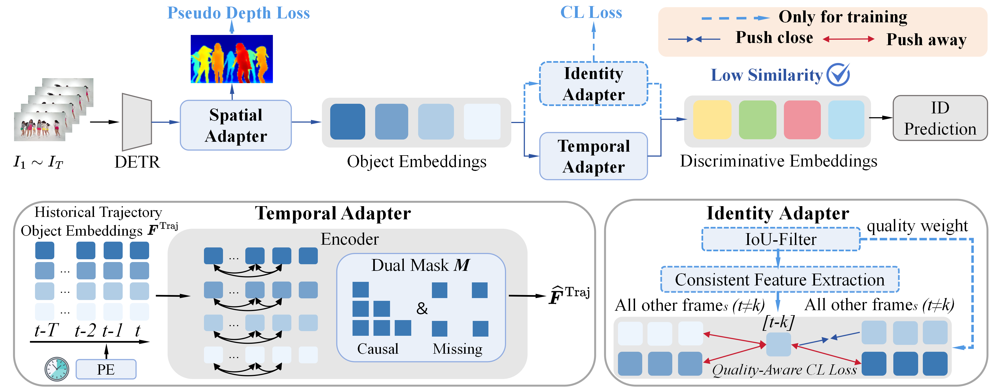

# [CVPR 2026]From Detection to Association: Learning Discriminative Object Embeddings for Multi-Object Tracking

[](https://arxiv.org/abs/2512.02392)
[](https://huggingface.co/Spongebobbbbbbbb/FDTA)


> **TL;DR.** We reveal that DETR-based end-to-end MOT suffers from overly similar object embeddings. FDTA explicitly enhances discriminativeness in this paradigm.



## 📢 News
* **[2026]** Our paper has been accepted by **CVPR 2026**! The code is now released. Please star this repo for updates!

## 🚀 Getting Started

### 1. Environment Setup

```shell
conda create -n FDTA python=3.12
conda activate FDTA
pip install -r requirements.txt
# Compile the Deformable Attention operator:
cd models/ops/
sh make.sh
```

### 2. Data Preparation

Please organize your datasets under `./datasets/` in the following structure. Note that **depth maps are required** alongside the RGB images:

```
datasets/
├── DanceTrack/
│   ├── train/
│   │   └── <sequence>/
│   │       ├── img1/
│   │       ├── gt/
│   │       └── depth/
│   ├── val/
│   └── test/
├── SportsMOT/
│   ├── train/
│   │   └── <sequence>/
│   │       ├── img1/
│   │       ├── gt/
│   │       └── depth/
│   ├── val/
│   └── test/
└── BFT/
    ├── train/
    │   └── <sequence>/
    │       ├── img1/
    │       ├── gt/
    │       └── depth/
    └── test/
```

> **Dataset sources:**
> - **DanceTrack**: Download from the [official repository](https://github.com/DanceTrack/DanceTrack).
> - **SportsMOT**: Download from the [official repository](https://github.com/MCG-NJU/SportsMOT) or [HuggingFace](https://huggingface.co/datasets/MCG-NJU/SportsMOT).
> - **BFT**: Download from [Google Drive](https://drive.google.com/drive/folders/140mPnOVZY-2apH76at9yYuVGIDWOvsH_?usp=sharing) or [Baidu Pan](https://pan.baidu.com/s/1Ztu8-JJLFHmMkJyWrJQ8lQ?pwd=bft5) ([NetTrack](https://github.com/george-zhuang/nettrack)).
> - **Depth maps**: Generated using [Video-Depth-Anything](https://github.com/DepthAnything/Video-Depth-Anything) (see `tools/gen_depthmaps.py`). Other depth estimators with the same directory structure are also supported.

### 3. Pre-trained Weights

We use COCO pre-trained Deformable DETR weights for initialization, sourced from [MOTIP](https://github.com/MCG-NJU/MOTIP). Download the weights and place them under `./pretrains/`:

| File | Description | Download |
|------|-------------|----------|
| `r50_deformable_detr_coco.pth` | COCO pre-trained (base) | [link](https://github.com/MCG-NJU/MOTIP/releases/download/v0.1/r50_deformable_detr_coco.pth) |
| `r50_deformable_detr_coco_dancetrack.pth` | Fine-tuned on DanceTrack | [link](https://github.com/MCG-NJU/MOTIP/releases/download/v0.1/r50_deformable_detr_coco_dancetrack.pth) |
| `r50_deformable_detr_coco_sportsmot.pth` | Fine-tuned on SportsMOT | [link](https://github.com/MCG-NJU/MOTIP/releases/download/v0.1/r50_deformable_detr_coco_sportsmot.pth) |
| `r50_deformable_detr_coco_bft.pth` | Fine-tuned on BFT | [link](https://github.com/MCG-NJU/MOTIP/releases/download/v0.1/r50_deformable_detr_coco_bft.pth) |

Our trained FDTA model weights are available on [HuggingFace](https://huggingface.co/Spongebobbbbbbbb/FDTA). Download and place them under `./checkpoints/` for inference.


### 4. Training

All training configurations are stored in the `./configs/` folder. For example, to train on **DanceTrack**:

```shell
accelerate launch --num_processes=4 train.py \
  --data-root /path/to/your/datasets/ \
  --exp-name fdta_dancetrack \
  --config-path ./configs/dancetrack.yaml \
  --detr-pretrain ./pretrains/r50_deformable_detr_coco_dancetrack.pth
```

Replace `dancetrack` with `sportsmot` or `bft` to train on other datasets.

> **Note:** If your GPU memory is less than 24GB, you can set `--detr-num-checkpoint-frames 2` (< 16GB) or `--detr-num-checkpoint-frames 1` (< 12GB) to reduce memory usage.

### 5. Inference

We support two inference modes:

- **`submit`**: Generate tracker files for submission .
- **`evaluate`**: Generate tracker files and compute evaluation metrics.

```shell
accelerate launch --num_processes=4 submit_and_evaluate.py \
  --data-root /path/to/your/datasets/ \
  --inference-mode evaluate \
  --config-path ./configs/dancetrack.yaml \
  --inference-model ./checkpoints/dancetrack.pth \
  --outputs-dir ./outputs/ \
  --inference-dataset DanceTrack \
  --inference-split val

accelerate launch --num_processes=4 submit_and_evaluate.py \
  --data-root /path/to/your/datasets/ \
  --inference-mode submit \
  --config-path ./configs/dancetrack.yaml \
  --inference-model ./checkpoints/dancetrack.pth \
  --outputs-dir ./outputs/ \
  --inference-dataset DanceTrack \
  --inference-split test
```

> You can add `--inference-dtype FP16` for faster inference with minimal performance loss.

---

## Main Results

### DanceTrack

| Training Data | HOTA | IDF1 | AssA | MOTA | DetA |
|---------------|------|------|------|------|------|
| train         | 71.7 | 77.2 | 63.5 | 91.3 | 81.0 |
| train+val     | 74.4 | 80.0 | 67.0 | 92.2 | 82.7 |

### SportsMOT

| Training Data | HOTA | IDF1 | AssA | MOTA | DetA |
|---------------|------|------|------|------|------|
| train         | 74.2 | 78.5 | 65.5 | 93.0 | 84.1 |

### BFT

| Training Data | HOTA | IDF1 | AssA | MOTA | DetA |
|---------------|------|------|------|------|------|
| train         | 72.2 | 84.2 | 74.5 | 78.2 | 70.1 |

## Acknowledgements

The code is built on top of these awesome repositories. We thank the authors for opensourcing their code.

* [Deformable-DETR](https://github.com/fundamentalvision/Deformable-DETR)
* [MOTR](https://github.com/megvii-research/MOTR)
* [MOTIP](https://github.com/MCG-NJU/MOTIP)
* [MonoDETR](https://github.com/ZrrSkywalker/MonoDETR)
* [TrackEval](https://github.com/JonathonLuiten/TrackEval)


##  Citation
If you find our work useful for your research, please consider citing:

```bibtex
@article{shao2025fdta,
  title={From Detection to Association: Learning Discriminative Object Embeddings for Multi-Object Tracking},
  author={Shao, Yuqing and Yang, Yuchen and Yu, Rui and Li, Weilong and Guo, Xu and Yan, Huaicheng and Wang, Wei and Sun, Xiao},
  journal={arXiv preprint arXiv:2512.02392},
  year={2025}
}
